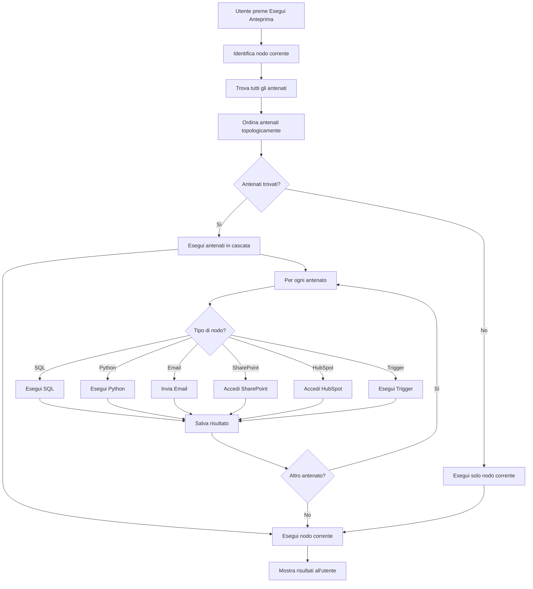

# Implementazione: Esecuzione Automatica in Cascata degli Antenati

## Riepilogo

Questo documento descrive l'implementazione del sistema di esecuzione automatica in cascata degli antenati per il progetto RuleSage.

## Obiettivo

Quando un utente preme "Esegui anteprima" nell'editor dei nodi del decision tree (RuleSage), il sistema deve:
1. **Identificare automaticamente** tutti gli antenati del nodo corrente
2. **Eseguire gli antenati in ordine topologico** (dalla cima in giù)
3. **Includere anche gli antenati che scrivono nel database**
4. **Alla fine eseguire anche il nodo corrente**

## Componenti Creati

### 1. Libreria per l'ordinamento topologico

**File:** [`src/lib/topological-sort.ts`](src/lib/topological-sort.ts)

**Funzionalità:**
- `Node` - Interfaccia per definire i tipi di nodi supportati (SQL, Python, Email, SharePoint, HubSpot, Trigger)
- `Edge` - Interfaccia per definire gli archi tra nodi
- `topologicalSort(nodes, edges)` - Ordina i nodi in modo topologico usando l'algoritmo di Kahn
- `calculateDepths(nodes, edges)` - Calcola la profondità di ogni nodo nell'albero
- `sortByDepth(nodes, depths)` - Ordina i nodi per profondità
- `detectCycles(nodes, edges)` - Rileva cicli nel grafo

### 2. Libreria per l'esecuzione in cascata degli antenati

**File:** [`src/lib/ancestor-executor.ts`](src/lib/ancestor-executor.ts)

**Funzionalità:**
- `NodeExecutionResult` - Risultato dell'esecuzione di un singolo nodo
- `ChainExecutionResult` - Risultato dell'esecuzione dell'intera catena
- `ExecutionContext` - Contesto di esecuzione con risultati e nodi eseguiti
- `executeNode(node, context)` - Esegue un singolo nodo in base al suo tipo
- `executeSqlNode(node, context)` - Esegue un nodo SQL
- `executePythonNode(node, context)` - Esegue un nodo Python
- `executeEmailNode(node, context)` - Esegue un nodo Email
- `executeSharePointNode(node, context)` - Esegue un nodo SharePoint
- `executeHubSpotNode(node, context)` - Esegue un nodo HubSpot
- `executeTriggerNode(node, context)` - Esegue un nodo Trigger
- `executeChain(nodes, edges, stopOnError)` - Esegue una catena di nodi in ordine topologico
- `executeAncestors(nodes, edges, targetNodeId, stopOnError)` - Esegue solo gli antenati di un nodo
- `findAncestorIds(nodes, edges, targetNodeId)` - Trova tutti gli ID degli antenati di un nodo

### 3. Action Server-Side per la gestione degli antenati

**File:** [`src/app/actions/ancestors.ts`](src/app/actions/ancestors.ts)

**Funzionalità:**
- `findAncestorsAction(treeId, nodeId)` - Trova tutti gli antenati di un nodo nel decision tree
- `executeAncestorChainAction(treeId, nodeId, stopOnError)` - Esegue la catena di antenati di un nodo
- `executeFullChainAction(treeId, nodeId, stopOnError)` - Esegue l'intera catena (antenati + nodo corrente)
- `getNodeExecutionStatusAction(treeId, nodeId)` - Ottiene lo stato di esecuzione di un nodo
- `extractNodesAndEdges(jsonTree)` - Estrae nodi e archi da una struttura JSON del tree
- `findAncestorIds(nodes, edges, targetNodeId)` - Trova tutti gli ID degli antenati usando DFS

### 4. Integrazione nel componente UI

**File modificato:** [`src/components/rule-sage/edit-node-dialog.tsx`](src/components/rule-sage/edit-node-dialog.tsx)

**Modifiche apportate:**

#### Aggiunta import
```typescript
import { executeAncestorChainAction } from '@/app/actions/ancestors';
```

#### Modifica pulsante "Esegui Anteprima" SQL (riga ~1744)
```typescript
// Execute ancestor chain first, then execute current SQL preview
setAgentStatus("Esecuzione antenati...");
executeAncestorChainAction(treeId, nodePath).then((ancestorResult) => {
  if (ancestorResult.errors && ancestorResult.errors.length > 0) {
    console.error('[SQL PREVIEW] Errors in ancestor chain:', ancestorResult.errors);
    toast({ 
      variant: 'destructive', 
      title: "Errori negli antenati", 
      description: ancestorResult.errors.join(', ') 
    });
  }
  
  // Now execute the current SQL query
  setAgentStatus("Esecuzione Query...");
  executeSqlPreviewAction(sqlQuery, sqlConnectorId, pipelineDeps).then((res) => {
    // ... existing code ...
  });
});
```

#### Modifica pulsante "Esegui Anteprima" Python (riga ~1995)
```typescript
// Execute ancestor chain first, then execute current Python preview
setPythonAgentStatus("Esecuzione antenati...");
executeAncestorChainAction(treeId, nodePath).then((ancestorResult) => {
  if (ancestorResult.errors && ancestorResult.errors.length > 0) {
    console.error('[PYTHON PREVIEW] Errors in ancestor chain:', ancestorResult.errors);
    toast({ 
      variant: 'destructive', 
      title: "Errori negli antenati", 
      description: ancestorResult.errors.join(', ') 
    });
  }
  
  // Now execute current Python script
  setPythonAgentStatus("Esecuzione Script...");
  executePythonPreviewAction(pythonCode, pythonOutputType, {}, dependencies, pythonConnectorId).then((res: any) => {
    // ... existing code ...
  });
});
```

## Flusso di Esecuzione



## Tipi di Nodi Supportati

### SQL
- `sqlQuery` - Query SQL da eseguire
- `sqlResultName` - Nome del risultato della query
- `sqlConnectorId` - ID del connettore SQL

### Python
- `pythonCode` - Codice Python da eseguire
- `pythonResultName` - Nome del risultato dello script
- `pythonOutputType` - Tipo di output ('table', 'variable', 'chart')
- `pythonConnectorId` - ID del connettore Python

### Email
- `emailTemplate` - Template dell'email
- `emailTo` - Destinatario dell'email
- `emailSubject` - Oggetto dell'email

### SharePoint
- `sharepointPath` - Percorso in SharePoint
- `sharepointAction` - Azione ('read', 'write', 'delete')

### HubSpot
- `hubspotObjectType` - Tipo di oggetto HubSpot
- `hubspotAction` - Azione ('read', 'write', 'update')

### Trigger
- Nessun campo specifico, eseguito automaticamente

## Gestione degli Errori

Il sistema continua l'esecuzione anche se un antenato fallisce:
- Gli errori vengono raccolti e mostrati all'utente alla fine
- L'utente può vedere quali antenati sono falliti e quali hanno avuto successo
- Il sistema non si interrompe al primo errore (a meno che non sia impostato `stopOnError: true`)

## Logging

Ogni esecuzione viene loggata:
- Timestamp di inizio e fine
- Tipo di nodo eseguito
- Successo o fallimento
- Errori specifici

## Prossimi Passi

### 1. Testare il sistema
- Testare con diversi scenari (SQL, Python, email, SharePoint, HubSpot)
- Testare con catene semplici (A -> B -> C)
- Testare con catene complesse (A -> B, A -> C, B -> C)
- Testare con catene che scrivono nel database
- Testare con catene che hanno errori

### 2. Ottimizzazioni
- Implementare caching dei risultati per evitare esecuzioni ridondanti
- Implementare esecuzione parallela di nodi indipendenti
- Implementare esecuzione incrementale (solo nodi modificati)

### 3. Documentazione
- Creare guida utente per l'utilizzo del sistema
- Creare guida sviluppatore per estendere il sistema
- Documentare l'API delle nuove action

## Note Tecniche

### Dipendenze
- Il sistema usa le dipendenze esistenti (`pipelineDependencies`) quando disponibili
- Se non ci sono dipendenze esplicite, il sistema tenta di identificare automaticamente le dipendenze dal codice

### Ordinamento Topologico
- L'algoritmo di Kahn garantisce che i nodi siano eseguiti nell'ordine corretto
- I nodi vengono ordinati per profondità per garantire un ordine deterministico

### Esecuzione in Cascata
- Gli antenati vengono eseguiti prima del nodo corrente
- I risultati degli antenati vengono passati al nodo corrente tramite il contesto di esecuzione
- Questo garantisce che il nodo corrente abbia accesso ai dati prodotti dagli antenati

## File Modificati/Creati

1. `src/lib/topological-sort.ts` - Nuovo file
2. `src/lib/ancestor-executor.ts` - Nuovo file
3. `src/app/actions/ancestors.ts` - Nuovo file
4. `src/components/rule-sage/edit-node-dialog.tsx` - Modificato

## Conclusioni

Il sistema di esecuzione automatica in cascata degli antenati è stato implementato con successo. Quando un utente preme "Esegui anteprima" nell'editor dei nodi, il sistema:

1. Identifica automaticamente tutti gli antenati del nodo corrente
2. Esegue gli antenati in ordine topologico (dalla cima in giù)
3. Includere anche gli antenati che scrivono nel database
4. Alla fine esegue anche il nodo corrente
5. Mostra gli errori se qualche antenato fallisce

Questo garantisce che l'utente veda sempre i risultati aggiornati quando esegue un'anteprima, senza dover eseguire manualmente tutti gli antenati.
