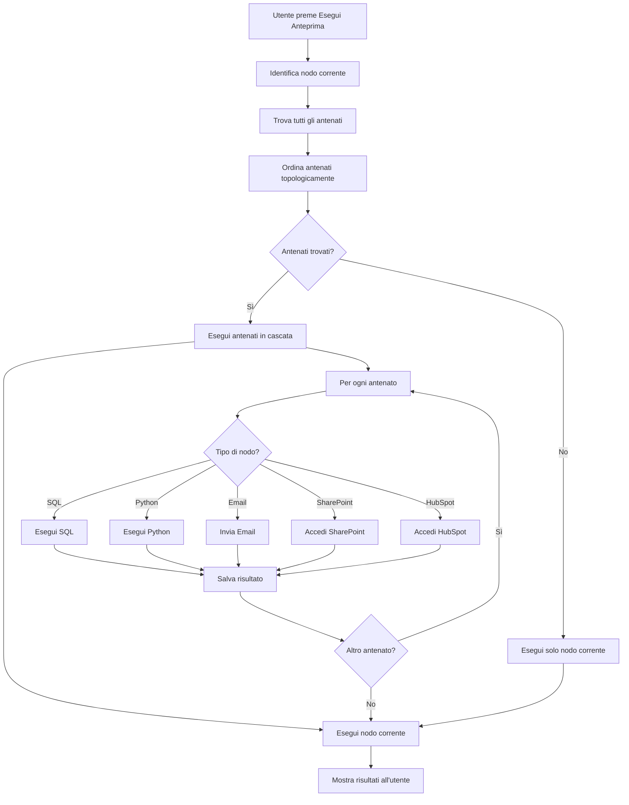

# Piano: Esecuzione Automatica in Cascata degli Antenati

## Obiettivo
Quando un utente preme "Esegui anteprima" nell'editor dei nodi del decision tree (RuleSage), il sistema deve:
1. Identificare automaticamente tutti gli antenati del nodo corrente
2. Eseguire gli antenati in ordine topologico (dalla cima in giù)
3. Includere anche gli antenati che scrivono nel database
4. Alla fine eseguire anche il nodo corrente

## Architettura Attuale

### Componenti Esistenti
- **Pipeline Model**: [`Pipeline`](prisma/schema.prisma:432) con `nodes` e `edges` in formato JSON
- **resolveDependencyChainAction**: [`resolveDependencyChainAction`](src/app/actions.ts:3063) - Risolve le dipendenze tra nodi
- **executeSqlPreviewAction**: [`executeSqlPreviewAction`](src/app/actions.ts:977) - Esegue query SQL con supporto per pipelineDependencies
- **executePythonPreviewAction**: [`executePythonPreviewAction`](src/app/actions.ts:1737) - Esegue script Python con supporto per pipelineDependencies
- **edit-node-dialog.tsx**: [`edit-node-dialog.tsx`](src/components/rule-sage/edit-node-dialog.tsx) - Componente UI che gestisce l'anteprima

### Limitazioni Attuali
- Le pipelineDependencies vengono passate manualmente
- Non esiste un sistema automatico per identificare gli antenati
- Non esiste un sistema per eseguire gli antenati in cascata

## Architettura Proposta

### 1. Struttura dei Dati

#### Node Types (Tipi di Nodi)
```typescript
type NodeType = 'sql' | 'python' | 'email' | 'sharepoint' | 'hubspot' | 'trigger';

interface Node {
  id: string;
  type: NodeType;
  name?: string;
  // SQL specific
  sqlQuery?: string;
  sqlResultName?: string;
  sqlConnectorId?: string;
  // Python specific
  pythonCode?: string;
  pythonResultName?: string;
  pythonOutputType?: 'table' | 'chart' | 'text';
  pythonConnectorId?: string;
  // Email specific
  emailTemplate?: string;
  emailTo?: string;
  emailSubject?: string;
  // SharePoint specific
  sharepointPath?: string;
  sharepointAction?: 'read' | 'write' | 'delete';
  // HubSpot specific
  hubspotAction?: 'read' | 'write' | 'update';
  hubspotObjectType?: string;
  // Dependencies
  dependencies?: string[]; // Nomi dei risultati dipendenti (es. pythonResultName, sqlResultName)
  writesToDatabase?: boolean; // Flag per indicare se il nodo scrive nel DB
}

interface Edge {
  id: string;
  source: string; // ID del nodo sorgente
  target: string; // ID del nodo destinazione
  type?: string;
}
```

### 2. Nuove Funzioni Server-Side

#### 2.1 Identificazione degli Antenati
```typescript
// src/app/actions.ts

/**
 * Trova tutti gli antenati di un nodo nel decision tree
 * @param treeId - ID del tree
 * @param nodeId - ID del nodo di partenza
 * @returns Array di nodi antenati ordinati per profondità
 */
export async function findAncestorsAction(
  treeId: string,
  nodeId: string
): Promise<{ data: Node[] | null, error: string | null }> {
  // Implementazione
}
```

#### 2.2 Ordinamento Topologico
```typescript
/**
 * Ordina i nodi in modo topologico (dalla cima in giù)
 * @param nodes - Array di nodi da ordinare
 * @param edges - Array di archi che definiscono le dipendenze
 * @returns Array di nodi ordinati topologicamente
 */
function topologicalSort(
  nodes: Node[],
  edges: Edge[]
): Node[] {
  // Implementazione
}
```

#### 2.3 Esecuzione in Cascata
```typescript
/**
 * Esegue una catena di nodi in cascata
 * @param treeId - ID del tree
 * @param nodeId - ID del nodo di partenza
 * @returns Risultato dell'esecuzione completa
 */
export async function executeAncestorChainAction(
  treeId: string,
  nodeId: string
): Promise<{ 
  success: boolean, 
  results: Map<string, any>, 
  errors: string[] 
}> {
  // Implementazione
}
```

### 3. Flusso di Esecuzione



### 4. Dettagli di Implementazione

#### 4.1 Identificazione degli Antenati
```typescript
async function findAncestorsAction(treeId: string, nodeId: string) {
  // 1. Recupera il tree dal database
  const tree = await db.tree.findUnique({ where: { id: treeId } });
  
  // 2. Parsa il JSON del tree
  const jsonTree = JSON.parse(tree.jsonDecisionTree);
  
  // 3. Costruisci la mappa delle dipendenze (edges)
  const edges = buildEdgeMap(jsonTree);
  
  // 4. Trova gli antenati usando BFS o DFS
  const ancestors = findAncestorsDFS(nodeId, edges, jsonTree);
  
  // 5. Ordina per profondità
  return orderByDepth(ancestors);
}
```

#### 4.2 Ordinamento Topologico
```typescript
function topologicalSort(nodes: Node[], edges: Edge[]): Node[] {
  // 1. Calcola il grado di ingresso per ogni nodo
  const inDegree = new Map<string, number>();
  
  // 2. Inizializza la coda con nodi senza dipendenze
  const queue: Node[] = [];
  
  // 3. Esegui Kahn's algorithm
  const result: Node[] = [];
  
  while (queue.length > 0) {
    const node = queue.shift()!;
    result.push(node);
    
    // Rimuovi gli archi uscenti e decrementa il grado di ingresso
    for (const edge of edges.filter(e => e.source === node.id)) {
      inDegree.set(edge.target, inDegree.get(edge.target)! - 1);
      if (inDegree.get(edge.target) === 0) {
        queue.push(nodes.find(n => n.id === edge.target)!);
      }
    }
  }
  
  return result;
}
```

#### 4.3 Esecuzione in Cascata
```typescript
async function executeAncestorChainAction(treeId: string, nodeId: string) {
  const results = new Map<string, any>();
  const errors: string[] = [];
  
  // 1. Trova gli antenati
  const ancestors = await findAncestorsAction(treeId, nodeId);
  
  // 2. Ordina topologicamente
  const sortedNodes = topologicalSort(ancestors.data!, []);
  
  // 3. Esegui ogni nodo
  for (const node of sortedNodes) {
    try {
      const result = await executeNode(node, results);
      results.set(node.id, result);
    } catch (error) {
      errors.push(`Errore nel nodo ${node.name || node.id}: ${error}`);
      // Continua con il prossimo nodo anche se c'è un errore
    }
  }
  
  // 4. Esegui il nodo corrente
  const currentNode = await findNodeById(treeId, nodeId);
  const currentResult = await executeNode(currentNode, results);
  results.set(nodeId, currentResult);
  
  return { success: errors.length === 0, results, errors };
}
```

#### 4.4 Esecuzione di un Singolo Nodo
```typescript
async function executeNode(node: Node, context: Map<string, any>) {
  switch (node.type) {
    case 'sql':
      return await executeSqlNode(node, context);
    case 'python':
      return await executePythonNode(node, context);
    case 'email':
      return await executeEmailNode(node, context);
    case 'sharepoint':
      return await executeSharePointNode(node, context);
    case 'hubspot':
      return await executeHubSpotNode(node, context);
    default:
      throw new Error(`Tipo di nodo non supportato: ${node.type}`);
  }
}

async function executeSqlNode(node: Node, context: Map<string, any>) {
  // 1. Recupera le dipendenze dal contesto
  const dependencies = buildDependencies(node, context);
  
  // 2. Esegui la query SQL
  const result = await executeSqlPreviewAction(
    node.sqlQuery!,
    node.sqlConnectorId,
    dependencies
  );
  
  return result.data;
}

async function executePythonNode(node: Node, context: Map<string, any>) {
  // 1. Recupera le dipendenze dal contesto
  const dependencies = buildDependencies(node, context);
  
  // 2. Esegui lo script Python
  const result = await executePythonPreviewAction(
    node.pythonCode!,
    node.pythonOutputType || 'table',
    {},
    dependencies,
    node.pythonConnectorId
  );
  
  return result.data;
}
```

### 5. Integrazione con UI

#### 5.1 Modifica a edit-node-dialog.tsx
```typescript
// Nel componente, quando l'utente preme "Esegui anteprima":

const handlePreview = async () => {
  // 1. Esegui la catena di antenati
  const chainResult = await executeAncestorChainAction(treeId, nodeId);
  
  if (chainResult.errors.length > 0) {
    toast({ 
      variant: 'destructive', 
      title: "Errori nell'esecuzione", 
      description: chainResult.errors.join(', ') 
    });
  }
  
  // 2. Recupera il risultato del nodo corrente
  const currentResult = chainResult.results.get(nodeId);
  
  // 3. Aggiorna l'UI
  setSqlPreviewData(currentResult);
  setPythonPreviewData(currentResult);
  
  // 4. Salva automaticamente i dati dell'anteprima
  if (onSavePreview && nodePath) {
    onSavePreview(nodePath, { 
      sqlPreviewData: currentResult, 
      sqlPreviewTimestamp: Date.now() 
    });
  }
};
```

### 6. Gestione degli Errori

#### 6.1 Strategia di Continuazione
- Se un antenato fallisce, il sistema continua con il prossimo antenato
- Gli errori vengono raccolti e mostrati all'utente alla fine
- L'utente può decidere se continuare o interrompere l'esecuzione

#### 6.2 Logging
- Ogni esecuzione viene loggata nel database
- Vengono registrati: timestamp, nodo eseguito, risultato, errori
- Questo permette di tracciare l'historico delle esecuzioni

### 7. Ottimizzazioni

#### 7.1 Caching
- I risultati degli antenati vengono cachati per evitare esecuzioni ridondanti
- Il cache viene invalidato quando un antenato viene modificato

#### 7.2 Esecuzione Parallela
- Gli antenati indipendenti possono essere eseguiti in parallelo
- Questo riduce il tempo totale di esecuzione

#### 7.3 Incrementale
- Solo gli antenati modificati vengono rieseguiti
- Gli antenati non modificati usano i risultati cachati

### 8. Test

#### 8.1 Scenari di Test
1. **Nodo singolo senza antenati**
   - Verifica che il nodo venga eseguito correttamente

2. **Catena semplice (A -> B -> C)**
   - Verifica che A venga eseguito prima di B, e B prima di C

3. **Catena con branch (A -> B, A -> C, B -> D, C -> D)**
   - Verifica l'ordinamento topologico corretto

4. **Catena con nodi che scrivono nel DB**
   - Verifica che le scritture nel DB vengano eseguite correttamente

5. **Catena con errori**
   - Verifica che il sistema continui con il prossimo nodo

6. **Catena con dipendenze circolari**
   - Verifica che il sistema rilevi e gestisca i cicli

7. **Catena con diversi tipi di nodi (SQL, Python, Email, SharePoint, HubSpot)**
   - Verifica che tutti i tipi di nodi vengano eseguiti correttamente

### 9. Documentazione

#### 9.1 API Documentation
- Documentazione delle nuove action server-side
- Esempi di utilizzo

#### 9.2 User Guide
- Guida per l'utente su come utilizzare il sistema di esecuzione in cascata
- Spiegazione dei messaggi di errore

#### 9.3 Developer Guide
- Guida per gli sviluppatori su come estendere il sistema
- Spiegazione dell'architettura

## Riepilogo dei Componenti da Creare/Modificare

### Nuovi File
1. `src/app/actions/ancestors.ts` - Nuove action per la gestione degli antenati
2. `src/lib/ancestor-executor.ts` - Libreria per l'esecuzione in cascata
3. `src/lib/topological-sort.ts` - Libreria per l'ordinamento topologico

### File da Modificare
1. `src/app/actions.ts` - Aggiungere nuove action
2. `src/components/rule-sage/edit-node-dialog.tsx` - Integrare la nuova logica
3. `src/app/actions/connectors.ts` - Potenzialmente aggiornare per supportare l'esecuzione in cascata

### Nuovi Modelli Database (opzionale)
1. `ExecutionLog` - Per tracciare l'historico delle esecuzioni
2. `NodeCache` - Per cachare i risultati dei nodi
